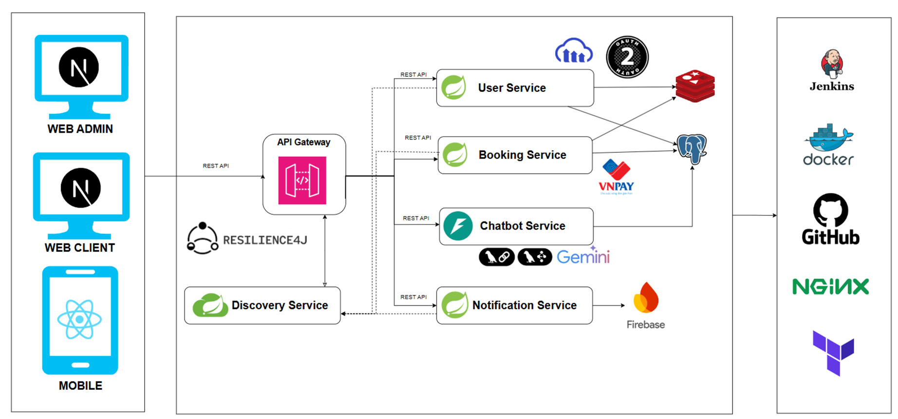
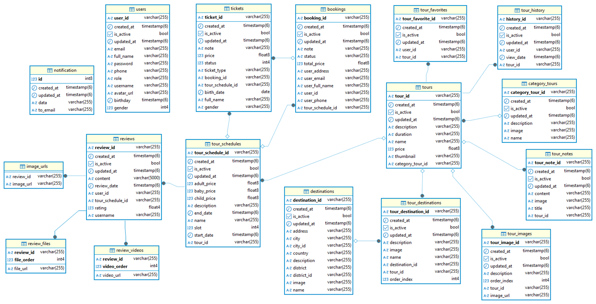

# 🧠 Backend -Tour Management and Booking System

Hệ thống Quản lý và Đặt tour du lịch là một ứng dụng web được xây dựng nhằm hỗ trợ người dùng dễ dàng tìm kiếm, lựa chọn và đặt các tour du lịch một cách nhanh chóng và an toàn. Hệ thống cũng cung cấp nền tảng quản trị cho nhà tổ chức tour để quản lý người dùng, lịch trình, đặt chỗ và thanh toán.

---

## ⚙️ Demo
🔗 Demo Frontend: https://travelsummornersrift.quindart.shop/

📖 Swagger UI: http://139.59.117.56:8080/swagger-ui/index.html

📂 Postman Collection: https://www.postman.com/zysteam-0324/workspace/travel-summoner-rift/collection/30580820-9ba06ecd-bba9-43e9-90f9-0a644a49cdcc?action=share&creator=30580820&active-environment=41787492-750f6d70-21bc-4fd1-bb4e-c698baabaf51

## ⚙️ Công nghệ sử dụng
🚀 Spring Boot

☁️ Spring Cloud

🧩 Microservices

🔗 REST API

🔐 OAuth2

🐘 PostgreSQL

⚡ Redis

🐳 Docker

💳 VNPay (môi trường test)

🤖 Jenkins CI/CD

🛡️ Resilience4j
## ⚙️ Tổng quan hệ thống

### 1. 🔐 API Gateway
- **Công nghệ:** Spring Cloud Gateway
- **Chức năng:**
    - Là entry-point cho toàn bộ client
    - Routing đến các microservice khác
    - Tích hợp `Resilience4j` để xử lý Circuit Breaker, Rate Limiting
    - Xác thực JWT token, truyền thông tin người dùng

---

### 2. 📡 Discovery Service
- **Công nghệ:** Eureka Server
- **Chức năng:** Cho phép các service tự đăng ký và phát hiện lẫn nhau → giảm cấu hình tĩnh

---

### 3. 👤 User Service
- **Chức năng:**
    - Đăng ký, đăng nhập, cập nhật thông tin người dùng
    - Xác thực bằng `OAuth2` và `JWT`
    - Gửi/kiểm tra OTP (qua Redis)
    - Phát hiện đăng nhập bất thường (IP/thiết bị lạ)
- **Tích hợp:**
    - PostgreSQL: lưu thông tin người dùng
    - Redis: lưu OTP, phiên đăng nhập

---

### 4. 📅 Booking Service
- **Chức năng:**
    - Quản lý tour, lịch trình, đặt chỗ
    - Xử lý các đơn đặt tour (Booking)
    - Tích hợp thanh toán qua `VNPay`
- **Tích hợp:**
    - PostgreSQL: lưu lịch sử booking
    - VNPay SDK

---

### 5. 💬 Chatbot Service
- **Chức năng:**
    - Tư vấn tour du lịch theo yêu cầu khách hàng
    - Giao tiếp qua WebSocket hoặc REST
    - Tích hợp AI với mô hình `Gemini` hoặc LLM

---

### 6. 🔔 Notification Service
- **Chức năng:**
    - Gửi thông báo đặt tour thành công, nhắc thanh toán, thông báo hệ thống
    - Sử dụng `Firebase Cloud Messaging (FCM)`

---

## 🗃️ Cơ sở dữ liệu

- **PostgreSQL**: Dùng cho User Service & Booking Service
- **Redis**: Lưu tạm thông tin như OTP, trạng thái đăng nhập

---

## 🛠️ DevOps & Triển khai

- **Docker**: Đóng gói service
- **Jenkins**: Tự động build CI/CD
- **NGINX**: Reverse proxy
- **Terraform**: Hạ tầng dưới dạng mã (IaC)

---

## 🔐 Bảo mật
- Xác thực người dùng: OAuth2, JWT
- Phân quyền người dùng theo role
- Kiểm tra IP và thiết bị lạ

 
